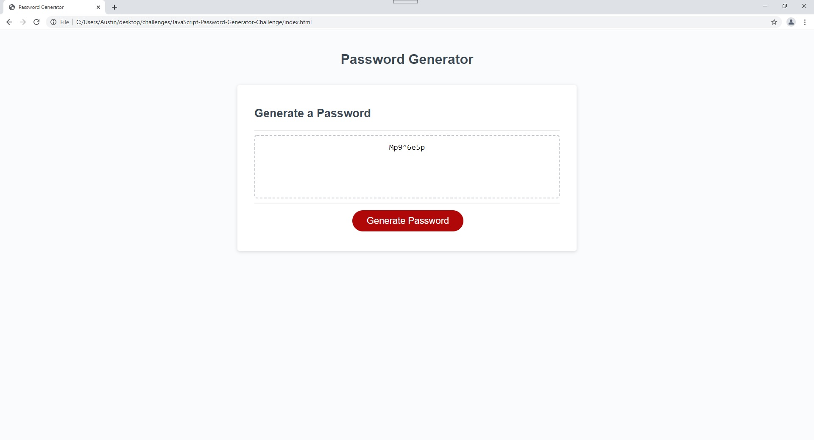

# JavaScript-Password-Generator-Challenge

By using a series of functions that incorporated confirm prompts, if statements, the String.fromCharCode
method, the Math.floor method, and the Math.random method I was able to 
generate random character types to be called by the generatePassword function.

I was able to generate a random password of fixed character length satisfying most
of the technical criteria.

As student feedback:

I was unable to get any user input to create the custom length desired because
no matter what I did I kept getting NaN displayed. Even after researching how to overcome
this issue I was still unable to resolve it.

I accept whatever partial credit I can receive on this assignment as the page works only
if yes is answered to all the prompts despite else statements to at least serve as flavor text.
I have much to learn about JavaScript and this assignment was way beyond what I could figure out
how to do and with the exception of a few concepts and methods it did not reflect the work done in
the module.

I even tried using code from the module's Robot Gladiators project, which while it worked in the
project, did now work here and continued to cause the NaN issue.

